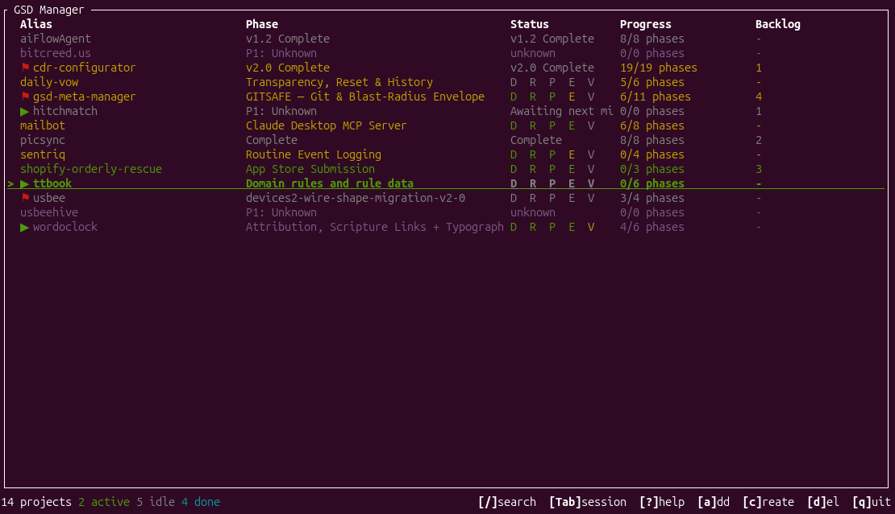
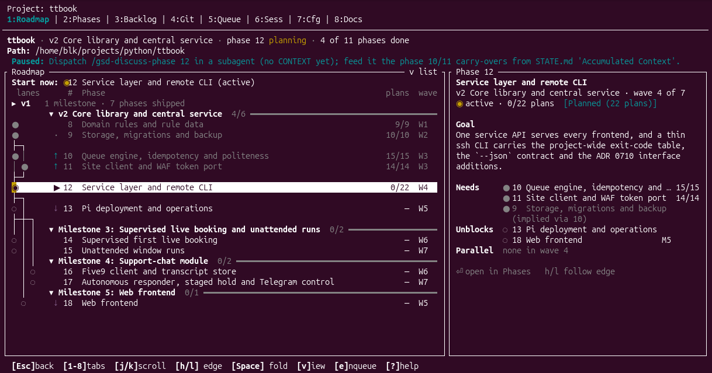

<!-- generated-by: gsd-doc-writer -->
# GSD Meta Manager

A TUI command center for managing multiple GSD-run projects from a single interface.

## What is it?

GSD (Get S\[oftware\] Done) Meta Manager gives you a unified dashboard across all
your GSD workflow projects. It reads `.planning/` state directly from disk -- no
need to launch Claude or run `/gsd-progress` in each project directory. Register
your projects once and see phase status, roadmap progress, queued work, and
pending actions at a glance.





## Why GSD Meta Manager?

GSD Meta Manager is the **cross-project** command center: it observes and acts on
*every* registered project at once, from a single terminal. What you get spanning
all of them:

- **Zero-token state reading** -- parses each project's `.planning/` directory on
  disk. No Claude run, no `/gsd-progress`, no API cost required to see status.
- **Claude session awareness** -- detects which projects have a live `claude`
  instance, launches or resumes a session on any of them, and auto-registers new
  projects from active sessions (Linux only -- see
  [Platform support](#platform-support)).
- **Initial Codex support** -- interactive `codex` sessions are detected and
  shown alongside Claude sessions (reachable with `Tab` under tmux), and the
  experimental driver can run a project whose manager-config entry sets
  `"runtime": "codex"` (or `preferences.default_runtime`) through `codex exec`. Resume stays Claude-only -- see
  [Platform support](#platform-support). Next-command suggestions also use a
  Codex-only GSD install (`~/.codex/gsd-core`, or `$CODEX_HOME/gsd-core`), and a
  driven `codex exec` child does not inherit the launching shell's `GSD_RUNTIME`,
  so GSD inside it takes its runtime from the project's config and its own install.
- **tmux focus** -- `Tab`-to-switch straight into a project's running Claude
  session without hunting through terminal tabs.
- **Milestone archive browsing** -- read shipped-milestone artifacts with inline
  markdown rendering in a project's Docs › Milestones sub-tab, without leaving
  the dashboard.

### Not the same as GSD's claude-orchestration backend

GSD 1.8.0 added an experimental, opt-in `claude-orchestration` execution backend.
That backend parallelizes plan execution *inside a single Claude session on a
single project* -- running a phase's waves concurrently via Claude Code's Workflow
tool -- and produces the same commits and `SUMMARY.md` artifacts as normal
execution, writing no new on-disk state format. GSD Meta Manager works at the
opposite scope: it observes and acts *across many projects* from one terminal. The
two are complementary -- orchestration speeds up work *within* one project's phase;
the Meta Manager gives you the view and the controls *across* your whole portfolio.

## Features

- Unified dashboard with color-coded project status (active, paused, idle).
  The dashboard's `k/n phases` and the Roadmap header's `k of n phases done`
  count the current milestone's phases; a phase is done once its
  implementation is finished (executed on disk, or ticked in ROADMAP.md when
  it has no phase directory). Verification state is shown separately
- Live filesystem watching -- auto-refreshes when `.planning/` files change
- Vim-style navigation (`j`/`k`, `/` search, `Enter` to drill in)
- Mouse support: click tabs, sub-tabs and rows, double-click to open, and
  scroll with the wheel; `M` turns mouse capture off and on
- 8-tab detail view (plus the experimental Driver tab): Roadmap (phase list
  with git-log-style dependency lanes and a detail pane showing each phase's
  goal, needs, unblocks and parallel phases), Phases (the selected phase's
  ladder and stage summary above a focusable Waves pane: one row per plan
  with its state, PLAN.md title and act/est tokens, finished waves folded),
  Backlog, Git History,
  Queue, Sessions (with an Agents sub-view), Config, Docs (Files: rendered
  `.planning/` browser rooted at
  the active phase, with quick jumps to `.planning/` and back; Milestones: the
  shipped-milestone archive)
- Queue management: create, edit, delete, and reorder items
- New project creation from within the TUI
- Session detection -- shows which projects have a live Claude instance;
  interactive Codex sessions are detected best-effort, without resume. Linux
  only -- see [Platform support](#platform-support)
- Running agents -- for each project, which GSD agents are running right now,
  read from git worktrees and Claude Code's subagent metadata without invoking
  Claude: the dashboard Status cell summarises the live wave (e.g. `w2/11 13run`,
  or an estimated `~5/12 fixed` for code-review fix runs), and the Sessions tab's
  Agents sub-view (`→` inside the Sessions tab) shows a one-line wave strip
  above every agent with its plan, commits, dirty files and last activity;
  `Enter` on an agent jumps to its plan in the Phases tab's Waves pane, and
  `Enter` on a plan there jumps back to its agent
- Auto-registration of GSD projects from active Claude sessions -- any running
  `claude` whose working directory contains `.planning/` is added to the
  registry automatically; a git linked worktree (e.g. an agent worktree under
  `.claude/worktrees/`) is never registered itself -- a session inside one, or
  in any subdirectory of it, resolves to its main worktree, and the
  main worktree is auto-registered instead when it has `.planning/` and is not
  already registered, so many concurrent agent sessions of one project yield a
  single entry; `add` still refuses a linked worktree and names the main
  worktree to add instead, and stale worktree entries are pruned from the
  config on launch
- Paused project detection (parses HANDOFF files). A handoff is ignored as
  stale when its phase is behind STATE.md's `current_phase`, or when STATE.md's
  `last_updated` is more than an hour newer than the handoff's `timestamp`
  (the file's mtime when it has none); the detail view then shows a dimmed
  "Stale HANDOFF ignored" hint instead of "Paused", and the dashboard raises
  no pause badge or needs-human flag for it
- Milestone archive browser with inline markdown rendering, in the Docs tab's
  Milestones sub-tab (`←` `→` inside the Docs tab switch Files / Milestones)
- Search and filter across projects

## Installation

Requires **Rust 1.88+**.

### From crates.io

```bash
cargo install gsd-meta-manager
```

### From source

```bash
cargo install --path .
```

### Build manually

```bash
cargo build --release
```

The binary is at `target/release/gsd-meta-manager`.

## Quick start

1. Install the binary:

   ```bash
   cargo install gsd-meta-manager
   ```

2. Launch the TUI:

   ```bash
   gsd-meta-manager
   ```

3. Register a project in the TUI (press `a`, type an alias for the project and
   press `Enter`, then enter the path to any directory that contains a
   `.planning/` folder), or via the CLI:

   ```bash
   gsd-meta-manager add /path/to/your/gsd-project
   ```

4. Active `claude` sessions whose working directory contains `.planning/` are
   auto-registered on launch and during the ~5s session poll. A git linked
   worktree (such as an agent worktree under `.claude/worktrees/`) is never
   registered itself. A session running inside one, or in any subdirectory of
   it, resolves to its main worktree, and that main worktree is auto-registered
   instead when it has `.planning/` and is not already registered, so many
   concurrent agent sessions of one project yield a single entry. `add` still
   refuses a linked worktree and names the main worktree to register instead,
   and stale worktree entries are pruned from the config on launch.

## Usage

```text
gsd-meta-manager --help
TUI command center for GSD projects

Usage: gsd-meta-manager [OPTIONS] [COMMAND]

Commands:
  add     Add a GSD project to the registry
  remove  Remove a project from the registry
  list    List all registered projects
  help    Print this message or the help of the given subcommand(s)

Options:
      --config <CONFIG>  Path to config file (overrides default location)
  -h, --help             Print help
  -V, --version          Print version
```

### Key bindings

| Key              | Action                  |
|------------------|-------------------------|
| `j` / `↓`        | Move the selection down |
| `k` / `↑`        | Move the selection up   |
| `Enter`          | Open project detail     |
| `b`              | Open project detail on the Backlog tab |
| `/`              | Filter projects. Type to filter; `Enter` keeps the filter, `Esc` clears it. The help overlay (`?`) lists the filter syntax |
| `s`              | Toggle sort: alphabetical / attention first |
| `a`              | Add an existing project: type an alias, `Enter`, then its path, `Enter`; `Esc` cancels |
| `c`              | Create a new project: enter a name, then a path (`Tab` completes it), then confirm with `y` / `Enter` |
| `d`              | Remove the selected project from the registry after a `y` / `n` confirm; project files are not deleted |
| `Tab`            | Switch the terminal to the selected project's Claude / Codex session |
| `?`              | Show / hide the help overlay (`j` / `k` and `PgUp` / `PgDn` scroll it; `Esc` also closes it) |
| `M`              | Toggle mouse capture    |
| `q`              | Quit (dashboard); back to the dashboard (detail view) |
| `Ctrl+C`         | Force quit from any screen |

With `GSDMM_EXPERIMENTAL_FEATURES` set, the dashboard's `r` / `x` / `o` start a
driver run, stop it and toggle driver opt-in, and `Shift+D` in the detail view
opens the experimental Driver tab; see [Configuration](docs/CONFIGURATION.md).

The detail view has two focus levels: the **tab bar** at the top and the
**content** of the active tab below it. It opens on the content of the tab you
last used; the active tab is shown bracketed, e.g. `[6:Sess]`, and while the tab
bar has focus it is also reversed and the content is dimmed.

| Key (detail view) | Action |
|-------------------|--------|
| `1`-`8`           | Jump straight into a tab's content |
| `←` `→`           | Tab bar: previous / next tab; stops at the first / last tab. Inside Sessions or Docs: previous / next sub-tab (Sessions / Agents, Files / Milestones), stopping at the ends. On the Phases tab, `→` focuses the Waves pane; with a Backlog item open, `←` closes it. Inside any other tab: switch tab and return to the tab bar |
| `↓` / `j` / `Enter` / `Space` | Tab bar: enter the tab's content (no action is taken) |
| `↑` / `k`         | From the first row of the content: back to the tab bar |
| `[` `]`           | Sessions / Docs: previous / next sub-tab (on the Roadmap list: previous / next phase in the same wave) |
| `Esc`             | Close an open pane or level first; otherwise go to the tab bar; at the tab bar, back to the dashboard |
| `q`               | Back to the dashboard from any level |
| `m`               | Sessions / Docs: switch sub-tab (alias of `←` `→`) |
| `Tab`             | Switch the terminal to this project's Claude / Codex session (on the Sessions tab, the highlighted session) |

`6` and `8` re-open the sub-tab you last used on the Sessions and Docs tabs.

Tab-specific keys:

| Tab | Key | Action |
|-----|-----|--------|
| Roadmap | `j` `k` `g` `G` `PgUp` `PgDn` | On the list view: move the phase cursor, jump to top / bottom, or page |
| Roadmap | `h` / `l` | Jump to a dependency / to a phase it unblocks; repeat to cycle |
| Roadmap | `[` / `]` | Previous / next phase in the same wave |
| Roadmap | `Space` | Fold / unfold the milestone |
| Roadmap | `Enter` | Open the phase in Phases. On a milestone row, fold / unfold it; on the shipped-milestones row, open Docs › Milestones |
| Roadmap | `v` | Switch between the graph list and the box view |
| Phases | `→` / `Enter` / `Space` | Focus the Waves pane (on top of the right side, under the ladder) |
| Waves pane | `j` `k` `g` `G` `PgUp` `PgDn` | Move the row cursor, top / bottom, page |
| Waves pane | `Enter` / `Space` | Fold / unfold a wave (or a merged `w1–w10 ✓` row); on a plan, jump to its agent in Sessions › Agents |
| Waves pane | `e` | Edit the plan's PLAN.md in `$EDITOR` at its objective |
| Waves pane | `←` / `Esc` | Back to the phase list (`q` still leaves the detail view; a digit, `[` or `]` leaves the pane and acts as usual) |
| Backlog | `Enter` | Open / close the item's content pane |
| Backlog | `j` `k` `PgUp` `PgDn` | Scroll the open content pane |
| Backlog | `e` | With the pane open, edit the item where it lives (e.g. its ROADMAP.md section) in `$EDITOR`; otherwise enqueue it |
| Backlog | `←` / `Esc` | Close the content pane |
| Git | `Enter` | Show the selected commit's message and diff stat |
| Git | `p` | Toggle planning-only commits |
| Git | `PgUp` / `PgDn` | Scroll by a page |
| Git | `Esc` | Close the commit pane |
| Queue | `a` | Add an item |
| Queue | `e` | Edit the selected item. The item is removed while you edit, so `Esc` leaves it removed |
| Queue | `d` / `x` | Delete the selected item (asks first) |
| Queue | `Enter` / `Space` | Mark the selected item done, which removes it from the queue |
| Queue | `J` / `K` | Move the selected item down / up |
| Sessions | `Enter` | Resume the selected Claude session (Codex sessions cannot be resumed) |
| Sessions | `n` | Launch a new Claude session in this project |
| Sessions › Agents | `Enter` | Jump to the agent's plan in the Phases Waves pane (navigation only; nothing is sent to the agent) |
| Config | `Enter` | Edit the selected value; in an open dropdown, apply the choice |
| Config | `x` | Clear (unset) the selected value |
| Config | `d` | Switch between the project's config and `~/.gsd/defaults.json` |
| Config | `r` | Reload the config from disk |
| Config | `/` | Filter the rows; `Esc` clears the filter |
| Docs › Files | `Enter` | Open the selected directory or file |
| Docs › Files | `Esc` | Close the file, then go up one directory |
| Docs › Files | `g` / `p` | Jump to the `.planning/` root / back to the active phase's directory |
| Docs › Files | `e` | Open the selected file in `$EDITOR` |
| Docs › Milestones | `Enter` | Open the milestone, phase or file |
| Docs › Milestones | `Esc` | Back up one level |
| Docs › Milestones | `e` | Archived files are read-only, so this only shows a status message |
| Any other tab | `e` | Enqueue the suggested next GSD command |

#### Mouse

Mouse capture is on by default, on the dashboard and in the detail view. Dialogs,
the help overlay and text entry (the `/` search, Config value edits and the
Config filter) ignore the mouse.

| Mouse | Action |
|-------|--------|
| Click | Select a dashboard row; in the detail view, switch tab or sub-tab (exactly like its digit key), or select a Phases, Sessions, Agents or Waves-pane row and focus that pane |
| Double-click | Open the row, the same as `Enter` (a project's detail view, session resume, the Agents <-> Waves-pane jumps, wave fold / unfold) |
| Wheel | Move the selection in the pane under the pointer, one row per step; it never switches tabs or climbs to the tab bar |
| `M` | Toggle mouse capture on / off (not saved) |
| Shift+drag | Select and copy text while mouse capture is on (terminal-dependent) |

To start with mouse capture off, set `"mouse": false` under `preferences` in
`config.json` (see [Configuration](docs/CONFIGURATION.md)).

### Examples

Register a project with a custom alias:

```bash
gsd-meta-manager add /home/me/projects/my-app my-app
```

List all registered projects:

```bash
gsd-meta-manager list
```

Remove a project from the registry:

```bash
gsd-meta-manager remove my-app
```

### Configuration

User configuration is stored at:

```text
~/.config/gsd-meta-manager/config.json
```

Override the config location with `--config <PATH>`.

## How it works

GSD Meta Manager reads each registered project's `.planning/` directory to infer
phase status, roadmap progress, queue state, and workflow position. A filesystem
watcher ([notify](https://crates.io/crates/notify)) triggers live updates
whenever planning files change on disk. A single async event loop
([tokio](https://crates.io/crates/tokio)) races terminal input, filesystem
events, and a render tick interval -- the UI never blocks on I/O.

The TUI is built with [ratatui](https://crates.io/crates/ratatui) and the
[crossterm](https://crates.io/crates/crossterm) backend for cross-platform
terminal support.

## Requirements

- **Rust 1.88+** (for building from source)
- Produces a single static binary with no runtime dependencies

### Platform support

Live session detection, for both Claude and Codex, reads the Linux `/proc`
filesystem, so it works on Linux only. On macOS no running sessions are
detected: the Sessions tab stays empty, and auto-registration from running
sessions, tmux `Tab`-to-switch, and resuming a detected session have nothing to
act on. The rest of the TUI -- everything read from `.planning/` -- works
normally.

Codex session detection is best-effort: it relies on Codex CLI process details
that may change between releases. Interactive `codex` sessions are shown
alongside Claude sessions and can be reached with `Tab` under tmux;
non-interactive runs such as `codex exec` are not shown. Codex sessions cannot
be resumed from the TUI -- resume is Claude-only.

### Compatibility

Reads GSD 1.8.0 `.planning/` state formats. Because it observes on-disk state
rather than driving GSD, it is non-intrusive and works alongside any GSD workflow
backend, including the experimental `claude-orchestration` execution path.

## Contributing

Contributions welcome. Please open an issue to discuss changes before submitting
a PR.

## License

MIT License -- see [LICENSE](LICENSE) for details.
