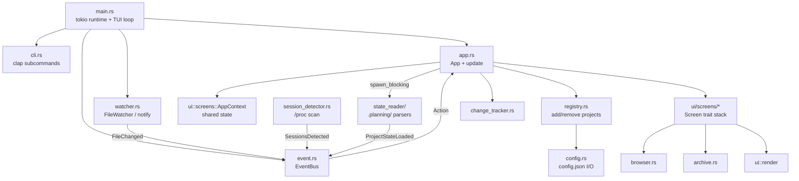

<!-- generated-by: gsd-doc-writer -->
# Architecture

## System Overview

`gsd-meta-manager` is a single-binary Rust TUI that aggregates the state of multiple GSD-run
projects into one dashboard. It reads each project's `.planning/` directory from disk (never
invoking Claude or any GSD command), watches those directories for filesystem changes via
`notify`, and renders an interactive ratatui interface backed by crossterm. The architecture is
an asynchronous, message-driven event loop: terminal input, filesystem events, periodic ticks,
and background I/O completions all funnel into a single `tokio::sync::mpsc::UnboundedReceiver<Action>`
that drives state mutation and re-render decisions.

## Component Diagram



## Data Flow

A typical update cycle proceeds as follows:

1. **Source emits an event.** One of three producers pushes an `Action` onto the channel
   created in `event.rs`:
   - `EventBus::spawn_crossterm_reader` reads `crossterm::event::EventStream` and maps key/resize
     events into `Action::RawKey` / `Action::Resize`.
   - `EventBus::spawn_tick` fires `Action::Tick` every 250ms (configured in `main.rs`).
   - `FileWatcher` (in `watcher.rs`) uses `notify_debouncer_full` with a 200ms debounce window;
     each batch is reduced to unique project roots via `extract_project_root`, then sent as
     `Action::FileChanged { project_path }`.
2. **Main loop receives the action.** `run_tui_loop` in `main.rs` awaits `rx.recv()` and calls
   `app.update(action)`.
3. **State is mutated.** `App::update` matches the action variant and either mutates `AppContext`
   directly (e.g. setting `status_message`) or schedules background work. For `FileChanged`, it
   debounces per-alias (500ms minimum between refreshes) and dispatches a `tokio::task::spawn_blocking`
   that calls `state_reader::parse_project_state` and sends back an `Action::ProjectStateLoaded`.
4. **Background completion re-enters the loop.** When the blocking task finishes, its result is
   sent through the same channel as a new `Action`, which `App::update` then applies to
   `AppContext.project_states` and invokes `change_tracker::detect_changes` to surface
   user-facing change notifications.
5. **Render decision.** When state changes flip `app.needs_redraw = true`, the loop calls
   `terminal.draw(|frame| ui::render(frame, app))`. `ui::render` delegates to the top screen on
   `app.screen_stack` (a `Vec<Box<dyn Screen>>`), which calls into ratatui widgets.
6. **Editor suspension (optional).** If a screen requested `ScreenAction::SuspendAndEdit`, the
   loop drops the terminal, spawns `$VISUAL` / `$EDITOR` / `vi` on the file via
   `std::process::Command`, then re-initializes ratatui.

## Key Abstractions

- **`Action` enum (`src/action.rs`)** — Tagged union of every event the app can react to:
  `Tick`, `RawKey`, `Resize`, `FileChanged`, `ProjectStateLoaded`, `GitLogLoaded`,
  `GitDiffStatLoaded`, `SessionsDetected`, `CreateProjectResult`,
  `ArchiveMilestonesDiscovered`, `ArchiveLoaded`. All side effects flow through this enum.
- **`EventBus` (`src/event.rs`)** — Owns the `mpsc::UnboundedSender<Action>` and
  `mpsc::UnboundedReceiver<Action>`. Spawns the crossterm reader and tick task.
- **`App` (`src/app.rs`)** — Top-level state holder: `should_quit`, `needs_redraw`, `ctx`
  (`AppContext`), `screen_stack`, `active_sessions`, `session_poll_counter`, `pending_editor`.
  Its `update(action)` method is the sole entry point for state mutation.
- **`AppContext` (`src/ui/screens/mod.rs`)** — Shared mutable state passed to every screen:
  `config`, `project_states`, table selection, filter text, `view_cache`,
  `change_tracker`, `event_tx`, `watcher`, `active_sessions`, etc. Screens read and mutate
  this struct through `&mut AppContext` parameters.
- **`Screen` trait (`src/ui/screens/mod.rs`)** — Three methods: `handle_key`, `render`, `name`.
  Implementations live in `src/ui/screens/{normal,detail,help,add_project,create_project,
  delete_confirm,enqueue,queue_delete_confirm}.rs`. Screens return `ScreenAction` enum values
  (`None`, `Push`, `Pop`, `Quit`, `SetStatusMessage`, `SuspendAndEdit`, `DispatchAction`) to
  signal navigation and side effects without owning the screen stack.
- **`ProjectState` (`src/state_reader/mod.rs`)** — Parsed snapshot of one project's
  `.planning/` directory: status, current phase, completion counts, milestone, phases,
  queued actions, per-phase disk inferences, pause state, etc.
- **`FileWatcher` (`src/watcher.rs`)** — Wraps a `notify_debouncer_full::Debouncer` with a
  200ms debounce. The callback extracts the project root (parent of `.planning/`) from each
  changed path and emits one `Action::FileChanged` per unique root.
- **`ChangeTracker` (`src/change_tracker.rs`)** — In-memory log of status transitions and
  phase completions since launch. Not persisted (per design decision D-07).
- **`ScreenAction::DispatchAction`** — Allows screens to enqueue arbitrary `Action`s back onto
  the bus. Used by long-running views (archive browser, git history) to request async data
  loads without blocking the render path.

## State Management

State is **not** wrapped in `Arc<RwLock<...>>`. The app is single-threaded at the state layer:
`App` and `AppContext` live on the main task and are mutated exclusively by `App::update`. All
concurrency happens at the I/O boundary:

- **Producers** (crossterm reader, tick task, watcher callback, `spawn_blocking` workers) own
  cloned `mpsc::UnboundedSender<Action>` handles and never touch `AppContext`.
- **Consumer** is the single `run_tui_loop` task that owns the receiver and calls `update`.

This is the classic Elm/Redux-style funnel: the channel itself provides the synchronization,
so no locks are needed inside the state. Blocking file I/O (`state_reader::parse_project_state`,
git log queries, archive scans) runs under `tokio::task::spawn_blocking` and sends results
back as `Action` variants — never mutating shared state from worker threads.

## Directory Structure Rationale

```
src/
├── main.rs                  binary entry: tokio runtime, CLI dispatch, TUI loop
├── lib.rs                   re-exports every non-binary module for tests
├── cli.rs                   clap definitions for `add` / `remove` / `list` subcommands
├── event.rs                 EventBus: crossterm reader + tick task + mpsc channel
├── tui.rs                   thin wrapper around ratatui::init / ratatui::restore
├── action.rs                Action enum (all message variants)
├── app.rs                   App struct, App::update dispatcher, DetailSubView, filter logic
├── config.rs                Config / RegisteredProject / Preferences serde types + I/O
├── registry.rs              add/remove project validation, auto-register from sessions
├── watcher.rs               FileWatcher around notify-debouncer-full
├── session_detector.rs      /proc scan for active `claude` processes
├── terminal_switch.rs       tmux pane switching to a detected Claude session
├── project_creator.rs       Bootstrap a fresh GSD project (used by CreateProjectScreen)
├── change_tracker.rs        In-memory change log
├── archive.rs               Milestone archive parsing for the Archive sub-view
├── browser.rs               .planning/ docs browser (directory listing + file view)
├── error.rs                 Reserved for custom error types (currently empty)
├── state_reader/            All `.planning/` file parsers
│   ├── mod.rs               ProjectState struct + parse_project_state aggregator
│   ├── state_md.rs          Parse STATE.md YAML frontmatter
│   ├── roadmap_md.rs        Parse ROADMAP.md phase list
│   ├── queue_md.rs          Parse QUEUE.md queued actions
│   ├── backlog.rs           Enumerate 999*-prefixed backlog phase dirs
│   ├── disk_status.rs       Infer phase status from on-disk artifacts
│   ├── config_json.rs       Parse `.planning/config.json` (GSD project config)
│   └── git_ops.rs           Shell out to `git log` / `git diff --stat`
└── ui/
    ├── mod.rs               ui::render entry point — delegates to top screen
    ├── roadmap_widget.rs    Custom ratatui widget for roadmap visualization
    └── screens/
        ├── mod.rs           Screen trait, ScreenAction, AppContext, ProjectViewCache
        ├── normal.rs        Project list (default screen)
        ├── detail.rs        Per-project detail with sub-views (PhaseList, Roadmap,
        │                    Backlog, GitHistory, Pipeline, Queue, Sessions, Archive,
        │                    Defaults, Browse)
        ├── add_project.rs   Add existing project to the registry
        ├── create_project.rs Bootstrap a new GSD project
        ├── delete_confirm.rs Confirm project removal
        ├── enqueue.rs       Append an action to a project's QUEUE.md
        ├── queue_delete_confirm.rs Confirm queue entry removal
        └── help.rs          Key-binding help overlay
tests/                       Integration tests (assert_fs against synthetic .planning/ trees)
```

The split between `state_reader/` (read-only `.planning/` parsing), `ui/screens/` (input +
render), and the top-level orchestration modules (`app.rs`, `event.rs`, `watcher.rs`)
keeps each layer independently testable. `lib.rs` exposes every module publicly so the
integration test suite under `tests/` can drive the same code paths the binary uses.

## Concurrency Model

- **One async task per producer.** `tokio::spawn` is used for: the crossterm event stream
  reader, the 250ms tick interval, and ad-hoc `spawn_blocking` workers for filesystem
  reads, git commands, and session detection.
- **One async task for the loop.** `run_tui_loop` runs to completion on the main `#[tokio::main]`
  task. It awaits exactly one `rx.recv()` per iteration, then performs at most one render.
- **No held locks across `.await`.** Because all shared state lives in `App` on the loop task
  and is never accessed off-task, the entire `tokio::sync::Mutex` vs `std::sync::Mutex`
  question is sidestepped.
- **Debouncing happens at two layers.** `notify_debouncer_full` collapses raw filesystem
  events within 200ms; `App::update` adds a second 500ms per-project guard via
  `AppContext.last_refresh` to prevent re-parse storms when multiple `.planning/` files
  change in rapid succession.

## Render Strategy

Rendering is **opt-in** rather than every-frame:

- `App.needs_redraw` and `AppContext.needs_redraw` default to `true` on startup.
- Screens set `ctx.needs_redraw = true` when their internal state changes; `App::update` sets
  `app.needs_redraw = true` after any state mutation that affects display.
- The loop reconciles `ctx.needs_redraw` into `app.needs_redraw` before each `recv()`, draws
  if set, then clears the flag.
- The 250ms tick exists only to expire status messages and poll for new Claude sessions
  (every 20 ticks ≈ 5s) — not to drive rendering.

This avoids burning CPU on a 60fps render loop when nothing has changed, which matters for
a long-running dashboard that may sit idle for hours between events.
